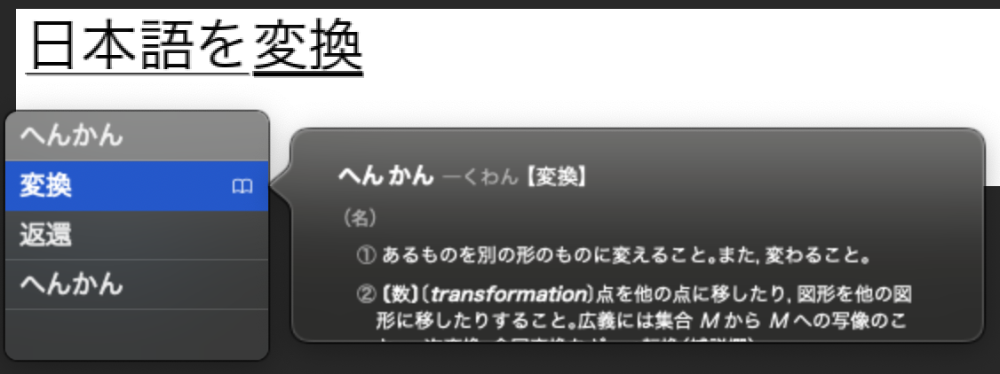

# ofxIME

openFrameworks addon for native OS IME (Input Method Editor) support.



## Overview

ofxIME enables Japanese text input in openFrameworks applications using the native OS IME. Unlike network-based solutions, it works offline with zero latency.

## Platform Support

| Platform | Status |
|----------|--------|
| macOS    | Supported |
| Windows  | Planned (contributions welcome!) |
| Linux    | Not supported |

Tested with openFrameworks 0.12.1 on macOS.

## Features

- Native IME integration (no network required)
- Japanese input with kanji conversion
- Multi-line text editing
- Cursor positioning by mouse click
- Enable/disable IME programmatically

## Installation

Clone this repository into your `addons` folder:

```bash
cd /path/to/openFrameworks/addons
git clone https://github.com/tettou771/ofxIME.git
```

## Usage

### Basic Setup

```cpp
#include "ofxIME.h"

class ofApp : public ofBaseApp {
    ofxIME ime;

    void setup() {
        // Set font (required for rendering)
        ime.setFont("/System/Library/Fonts/ヒラギノ角ゴシック W3.ttc", 24);
        ime.enable();
    }

    void draw() {
        ofSetColor(255);
        ime.draw(20, 50);
    }
};
```

### API

```cpp
// Enable/disable IME
ime.enable();
ime.disable();
bool enabled = ime.isEnabled();

// Check input mode
bool japanese = ime.isJapaneseMode();

// Get text
string text = ime.getString();

// Clear text
ime.clear();

// Set cursor position by mouse
ime.setCursorByMouse(mouseX, mouseY);
```

For a complete example, see the `example` folder.

## License

MIT License - see [LICENSE](LICENSE) for details.

## Author

[tettou771](https://github.com/tettou771)

## Related

- [ofxGoogleIME](https://github.com/tettou771/ofxGoogleIME) - Google Transliterate API based IME (deprecated API)
